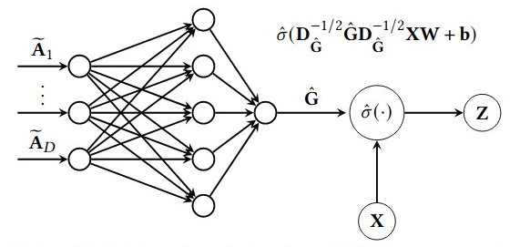

PDN
============================================


[](https://arxiv.org/abs/2010.12878) [](https://codebeat.co/projects/github-com-benedekrozemberczki-pdn-master)
 [](https://github.com/benedekrozemberczki/PDN/archive/master.zip)⠀
 
 A PyTorch implementation of "Pathfinder Discovery Networks for Neural Message Passing" (WebConf 2021).


<p align="center">
  
</p>

### Abstract

<p align="justify">
In this work we propose Pathfinder Discovery Networks (PDNs), a method for jointly learning a message passing graph over a multiplex network with a downstream semi-supervised model. PDNs inductively learn an aggregated weight for each edge, optimized to produce the best outcome for the downstream learning task. PDNs are a generalization of attention mechanisms on graphs which allow flexible construction of similarity functions between nodes, edge convolutions, and cheap multiscale mixing layers. We show that PDNs overcome weaknesses of existing methods for graph attention (e.g. Graph Attention Networks), such as the diminishing weight problem. Our experimental results demonstrate competitive predictive performance on academic node classification tasks. Additional results from a challenging suite of node classification experiments show how PDNs can learn a wider class of functions than existing baselines. We analyze the relative computational complexity of PDNs, and show that PDN runtime is not considerably higher than static-graph models. Finally, we discuss how PDNs can be used to construct an easily interpretable attention mechanism that allows users to understand information propagation in the graph.</p>

This repository provides a PyTorch implementation of PDN as described in the paper:

> Pathfinder Discovery Networks for Neural Message Passing.
> Benedek Rozemberczki, Peter Englert, Amol Kapoor, Martin Blais, Bryan Perozzi.
> WebConf, 2021.
> [[Paper]](https://arxiv.org/abs/2010.12878)


### Requirements
The codebase is implemented in Python 3.5.2. package versions used for development are just below.
```
tqdm               4.28.1
numpy              1.15.4
texttable          1.5.0
argparse           1.1.0
torch              0.4.1
torch-geometric    0.3.1
torch_spline_conv  1.0.4
torch_sparse       0.2.2
torch_scatter      1.0.4
torch_cluster      1.1.5
```

### Datasets
<p align="justify">
The code takes the **edge list** of the graph in a csv file. Every row indicates an edge between two nodes separated by a comma. The first row is a header. Nodes should be indexed starting with 0. A sample graph for `Pubmed` is included in the  `input/` directory. In addition to the edgelist there is a csv file with the sparse features and another one with the target variable.</p>
<p align="justify">
The **feature matrix** is a sparse one and it is stored as a csv. Features are indexed from 0 consecutively. The feature matrix csv is structured as:</p>

| **NODE ID**|**FEATURE ID**|**Value** |
| --- | --- |---|
| 0 | 3 |0.2|
| 0 | 7 | 0.5 |
| 1 | 17 | 0.8 |
| 1 | 4 | 5.4 |
| 1 | 38 | 1.3 |
| ... | ... |...|
| n | 3 | 0.9 |
<p align="justify">
The **target vector** is a csv with two columns and headers, the first contains the node identifiers the second the targets. This csv is sorted by node identifiers and the target column contains the class meberships indexed from zero.</p>

| **NODE ID**|**Target** |
| --- | --- |
| 0 | 3 |
| 1 | 1 |
| 2 | 0 |
| 3 | 1 |
| ... | ... |
| n | 3 |

### Options
<p align="justify">
The training of a ClusterGCN model is handled by the `src/main.py` script which provides the following command line arguments.</p>

#### Input and output options
```
  --edge-path       STR    Edge list csv.         Default is `input/edges.csv`.
  --features-path   STR    Features csv.         Default is `input/features.csv`.
  --target-path     STR    Target classes csv.    Default is `input/target.csv`.
```
#### Model options
```
  --clustering-method   STR     Clustering method.             Default is `metis`.
  --cluster-number      INT     Number of clusters.            Default is 10. 
  --seed                INT     Random seed.                   Default is 42.
  --epochs              INT     Number of training epochs.     Default is 200.
  --test-ratio          FLOAT   Training set ratio.            Default is 0.9.
  --learning-rate       FLOAT   Adam learning rate.            Default is 0.01.
  --dropout             FLOAT   Dropout rate value.            Default is 0.5.
  --layers              LST     Layer sizes.                   Default is [16, 16, 16]. 
```
### Examples
<p align="justify">
The following commands learn a neural network and score on the test set. Training a model on the default dataset.</p>

```sh
$ python src/main.py
```
<p align="center">

</p>

Training a ClusterGCN model for a 100 epochs.
```sh
$ python src/main.py --epochs 100
```
Training a model with a different layer structure:
```sh
$ python src/main.py --layers 64 64
```
--------------------------------------------------------------------------------

**License**

- [GNU](https://github.com/benedekrozemberczki/ClusterGCN/blob/master/LICENSE)
